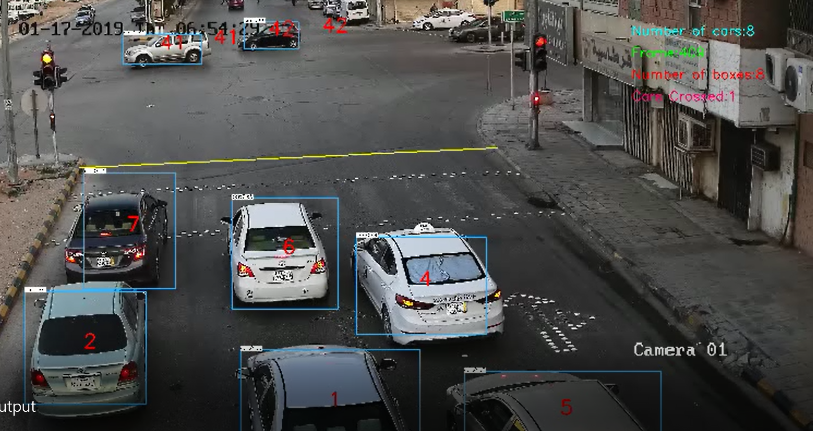

# yolo-car-tracking
In this project You Only Look Once (Yolo) algorithm is trained on a custom dataset to detect cars. Afterwards, and when YOLO gives acceptable results, car tracking is built on top of YOLO multi object detection algorithm on OpenCV. The idea of the object tracking in this code is to related the objects in the current frame to the closest objects inside a circle in the previous frame. If no objecs are found inside the circle object tracking is lost. The objects x and y positions are then filtered using first order low pass filters to reduce the noise in the tracking process. As a demonistration to crossing the street juction, a counter is increased whenever a car crosses the yello line. The implementaion is in C++

Watch the video:

